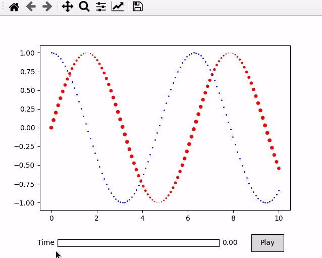

[](https://animatplot.readthedocs.io/en/latest/?badge=latest)

# animatplot
A python package for making interactive as well as animated plots with matplotlib.




## Requires
- Python >= 3.5
- Matplotlib >= 2.2 (because [sliders have discrete values](https://matplotlib.org/users/whats_new.html#slider-ui-widget-can-snap-to-discrete-values))
## Installation
```bash
pip install animatplot
```

or using conda
```bash
conda install animatplot -c conda-forge
```

## Documentation
Documentation can be found [here](https://animatplot.readthedocs.io/en/latest/index.html)

## Dev Install
```bash
git clone https://github.com/t-makaro/animatplot.git
pip install -e .
```
This project uses ```pycodestyle``` for linting. For testing, ```pytest``` is used.
